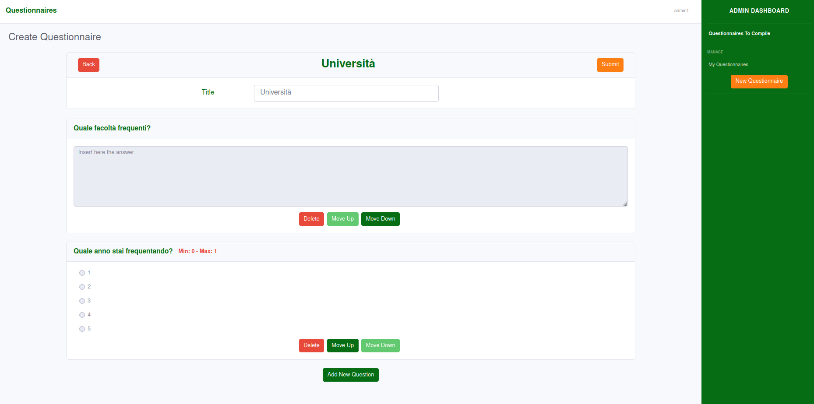

# Web Application 1 exam

### Requirements, Language and Frameworks

* Javascript EM6
* Node.js LTS 14.16
* React.js
* react-bootstrap

### Steps to install correctly the environment

- Clone the project using `git clone <repo url>`
- Move in the directory and perform the following operations to start the server:
  - `cd web_application_1_project/server`
  - `npm install`
  - `node server.js` or `nodemon server.js`
- On another console perform those operations to start the client:
  - `cd web_application_1_project/client`
  - `npm install`
  - `npm start`

## React Client Application Routes

- Route `/`: show the list of questionnaires available to compile.
- Route `/login`: show the login form for authentication.
- Route `/manage`: show user's questionnaires and permits to delete them or see results of them.
- Route `/create`: permits to create a questionnaire.
- Route `/compile/:id`: show question list of a questionnaire and permits to submit a compile. `<id>` is the questionnaire's id.
- Route `/results/:id`: show a results for a specific questionnaire. `<id>` is the questionnaire's id.

## API Server

- POST `/api/sessions`
  - Request body content: A JSON object with username and password of the admin
  ```
  {username:<username>, password:<password>}
  ```
  - Response body content: A JSON object with information about the admin
  ```
  {id: <id>, username:<username>, name:<name>}
  ```
- GET `/api/sessions/current`
  - Request body content: No requested body. Check is performed with cookie
  - Response body content: A JSON object with information about the admin
  ```
  {id: <id>, username:<username>, name:<name>}
  ```
- DELETE `/api/sessions/current`
  - Request body content: No requested body
  - Response body content: No response body
- GET `/api/admin/questionnaires`
  - Request body content: No request body. Information about user are taken from cookie
  - Response body content: A JSON object with the list of the authenticated user's questionnaires
  ```
  [{
    id: <id>,
    admin: <id_user>,
    title: <questionnaire's title>,
    compiled: <num of compiles>,
    questions: [
      { id: <id_question>, title: <title_question>, open: true, required: true },
      {
        id: <id_question>,
        title: <id_question>,
        open: false,
        min: 1,
        max: 1,
        options: [
          { id: <id_option>, value: <text_option> },
          ...
        ],
      },
      ...
    ],
  },
  ...]
  ```
- GET `/api/questionnaires`
  - Request body content: No request body
  - Response body content: A JSON object with the list of all available questionnaires
  ```
  [{
    id: <id>,
    title: <questionnaire's title>,
    questions: [
      { id: <id_question>, title: <title_question>, open: true, required: true },
      {
        id: <id_question>,
        title: <id_question>,
        open: false,
        min: 1,
        max: 1,
        options: [
          { id: <id_option>, value: <text_option> },
          ...
        ],
      },
      ...
    ],
  },
  ...]
  ```
- GET `/api/questionnaires?id=<id>`
  - Request body content: No request body
  - Response body content: A JSON object with the questionnaire with id=`<id>`
  ```
  {
    id: <id>,
    title: <questionnaire's title>,
    questions: [
      { id: <id_question>, title: <title_question>, open: true, required: true },
      {
        id: <id_question>,
        title: <id_question>,
        open: false,
        min: 1,
        max: 1,
        options: [
          { id: <id_option>, value: <text_option> },
          ...
        ],
      },
      ...
    ],
  }
  ```
- GET `/api/admin/answers?id=<id>`
  - Request body content: No request body
  - Response body content: A JSON object with all the answers to a specific questionnaire, which has id=`<id>`
  ```
  {
    id: <id_questionnaire>,
    compiles: [
      {
        username: <name>,
        answers: [
          { id: <id_question>, answer: <text_answer> },
          { id: <id_question>, selection: <index_of_selection> },
          { id: <id_question>, options: [false, true, false, false, true] },
          ...
        ],
      },
      ...
    ]
  }
  ```
- POST `/api/admin/questionnaires`
  - Request body content: A JSON object with the questionnaire created
  ```
  {
    admin: <id_user>,
    title: <questionnaire's title>,
    compiled: 0,
    questions: [
      { id: <id_question>, title: <title_question>, open: true, required: true },
      {
        id: <id_question>,
        title: <id_question>,
        open: false,
        min: 1,
        max: 1,
        options: [
          { id: <id_option>, value: <text_option> },
          ...
        ],
      },
      ...
    ],
  }
  ```
  - Response body content: A JSON object with the id of the created questionnaire
  ```
  { id_questionnaire: <id> }
  ```
- POST `/api/answers?id=<id>`
  - Request body content: A JSON object with answers for the questionnaire with id=`<id>`
  ```
  {
    username: <name>,
    answers: [
      { id: <id_question>, answer: <text_answer> },
      { id: <id_question>, selection: <index_of_selection> },
      { id: <id_question>, options: [false, true, false, false, true] },
      ...
    ],
  }
  ```
  - Response body content: A JSON object with the id of the answers' questionnaire 
  ```
  { id_questionnaire: <id> }
  ```
- DELETE `/api/admin/questionnaires?id=<id>`
  - Request body content: No request body
  - Response body content: A JSON object with the id of the deleted questionnaire 
  ```
  { id_questionnaire: <id> }
  ```
## Database Tables

- Table `users` - contains: id username hash name. Save informations about administrators.
- Table `questionnaires` - contains: id title id_user num_submit. Save informations about questionnaires (without questions).
- Table `questions` - contains: id id_questionnaire open question answer_1 answer_2 answer_3 answer_4 answer_5 answer_6 answer_7 answer_8 answer_9 answer_10 min max. Save all questions of all questionnaires.
- Table `answers` - contains: id_compile id_questionnaire id_question answer option name open selection. Save answers to questions of questionnaires.

## Main React Components

- `App` (in `App.js`): manage all routes of the application. Logged user will be able to perform different actions. Not logged user will only be able to compile questionnaires. It performs download of questionnaires.
- `QuestionnaireCompile` (in `QuestionnaireCompile.js`): permits to a user to compile a questionnaire and save it. It retrive from server the questionnaire to compile.
- `QuestionnaireCreate` (in `QuestionnaireCreate.js`): permits to an admin to create a new questionnaire and save it.
- `QuestionnaireBox` (in `QuestionnaireBox.js`): for questionnaires to comile show a button in order to compile the questionnaire. For admin's questionnaire show buttons to manage it and the number of compiles.
- `QuestionnaireResult` (in `QuestionnaireResult.js`): show to an admin result for a single questionnaire. Show all the compiles.
- `Questionnaires` (in `Questionnaires.js`): show all the available questionnaire to compile.
- `QuestionnaireManage` (in `QuestionnaireManage.js`): show all admin's questionnaires. It manage the delete of a questionnaire.
- `Login` (in `Login.js`): show a form for the authentication of an admin.
- `Navbar` (in `Navbar.js`): Contains a button in order to perform login
- `Sidebar` (in `Sidebar.js`): Shown only for administrators. Permits to manage personal questionnaires and also compile questionnaires.


## Screenshot



## Users Credentials
- admin1@test.it, password (owner of "Musica" questionnaire)
- admin2@test.it, password (owner of "Vacanze" questionnaire)
